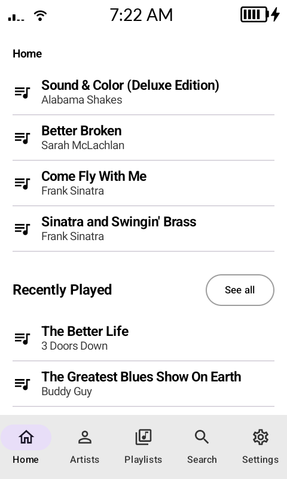
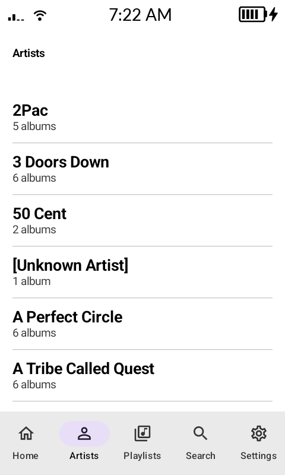
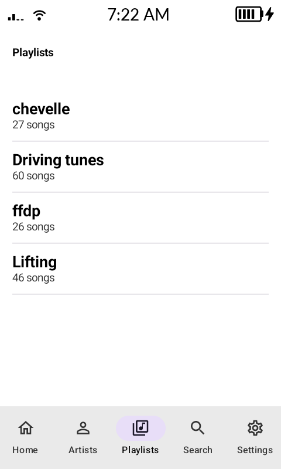
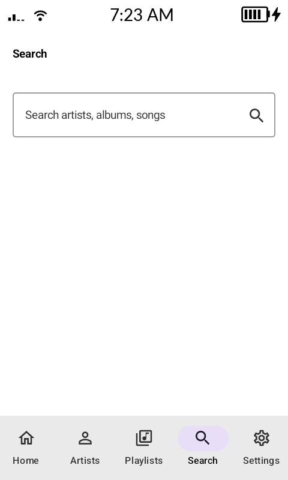

# ErdStream

A minimal Subsonic/Navidrome-compatible music streaming client for Android, built for e-ink phones like the Mudita Kompakt and Light Phone 3 (I won't have a light phone until September so I can't test yet)

No themes, no album art, no clutter — just a plain grayscale UI that connects to your own Navidrome (or any Subsonic API) server and streams your library.

<p align="center">
  
  
  
  
</p>

## Features

- Connects to any Subsonic API server (Navidrome, etc.)
- Server-side transcoding — pick a lower bitrate and the server transcodes on the fly, so lossless libraries (e.g. FLAC) don't have to be streamed at full size
- Home tab with recently added albums, recently played albums, most played albums, an album mix, and a track mix
- Browse by artist, album, and playlist; search across your library
- Background playback via a Media3 media session, with lock screen / notification controls and a home screen widget
- On-device media cache to reduce stutter and re-streaming
- Configurable bottom navigation — reorder or hide tabs in Settings

## Requirements

- Android 9.0 (API 28) or higher
- A reachable Subsonic API server (e.g. [Navidrome](https://www.navidrome.org/))

## Installing

Prebuilt, signed APKs are attached to each [release](https://github.com/erdius/ErdStream/releases). Android will still warn about installing from an unknown source since it's not distributed via Google Play — you'll need to allow it for your browser or file manager.

## Building

```sh
./gradlew assembleDebug
```

The debug APK will be at `app/build/outputs/apk/debug/app-debug.apk`. Building a signed release APK (`./gradlew assembleRelease`) requires a `keystore.properties` file (see `app/build.gradle.kts`) pointing at your own signing key — this isn't included in the repo.

## Connecting

On first launch, enter your server URL, username, and password. Credentials are stored locally using `EncryptedSharedPreferences`.

## License

MIT — see [LICENSE](LICENSE).
